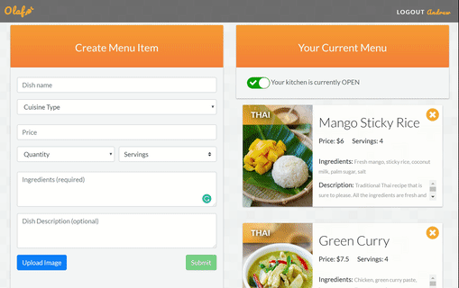
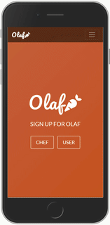

# Olaf

## Overview

Olaf is a community-driven food service web application, which offers seller and customer
interactivity. Using our interactive and intuitive interface, anyone can create an account as a
chef (seller), user (customer), or both! 

## Chef Experience

As an Olaf Chef, you are able to create a personalized menu using the “Create Menu Item” form. Using this tool, you can add new food items to “Your Current Menu”, by providing relevant information, such as the name, cuisine, price, quantity, ingredients, item description, and even a photo (Cloudinary) of your dish! You can toggle between your kitchen being “OPEN” or “CLOSED” (react-switch-toggle) which will display to potential customers if you are available to sell. A notification will be sent to you via SMS (Twilio) once a customer has successfully placed an order. 

Here is an example of a chef creating an item then posting it online.

## Customer Experience

As an Olaf User, you will enjoy a wide variety of home cooked cuisines. Olaf Chefs are marked on the map (Google Maps/Google Geocoding) by a carrot icon. Once a carrot is clicked, you will be able to view the items a chef has available for sale, add them to your shopping cart, and confirm your final order. A notification will be sent to you via SMS (Twilio), providing a total cost and pickup address, once you have successfully placed an order. 

Here is an example of the customer shopping experience.

[Here](https://olafui.herokuapp.com/) is a link to the deployed application. And below are some images showcasing some of the features of our application.

## Mobile Responsivness

Yes, our application is mobile responsive. It looks nice and functions well at all screen sizes. Here, have a look!

 

## Technologies Used

* React.js (web framework)
* MDBootstrap (style/grid system)
* MySQL (database)
* Sequelize
* Axios (backend API connection)
* react-switch-toggle (toggle feature)
* Google Map API (map feature)
* Google Geocoding (location service)
* Cloudinary Widget (photo upload/storage)
* Twilio (Short Message Service)
* Font Awesome (logo and icons)
* Visual Studio Code (code editor)
* Our backend server and database API can be seen [here](https://github.com/SwathiPottigari/OlafAPI)

## Contributors

Made in collaboration with:
* [Shivali Bhalla](https://github.com/sbc1133)
* [Swathi Pottigari](https://github.com/SwathiPottigari)
* [Willie Edwards](https://github.com/WillieEdwards)
* [Andrew Weiss](https://github.com/wandrew8)

Visit our github accounts to see more of our work. Thanks for visiting and finally a huge shout-out to all the support and assistance from our teacher, TAs, and fellow classmates!